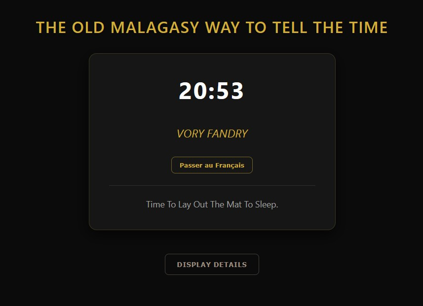

# LERA-MALAGASY

The way Malagasy people used to tell the current time when the watches were not yet common,
based on daily activities and natural events.

## Live demo

View the live clock here: [https://rabalita.com/apps/lera-malagasy](https://rabalita.com/apps/lera-malagasy).

Each Malagasy locution can also displays its English or French translation.

<p align="center">
    
</p>

## Usage

Import the JSON file into your project:

```js
// ES Modules
import lera from "./lera-malagasy.json";
```

or

```js
// CommonJS
const lera = require("./lera-malagasy.json");
```

## Complete file content

```js
{
  "00h00": {  "mg_MG": "MISASAKALINA",
              "en_EN": "Midnight.",
              "fr_FR": "Minuit."},

  "01h00": {  "mg_MG": "MITRENA OMBALAHY",
              "en_EN": "Midnight.",
              "fr_FR": "Le boeuf mugit."},

  "01h30": {  "mg_MG": "MANENO SAHONA; MODY MPAMOSAVY",
              "en_EN": "The toad croaks; the witches go home.",
              "fr_FR": "Le crapaud coasse; Les sorcières rentrent chez elles."},

  "02h00": {  "mg_MG": "MIVOAKA GOAIKA; MISAFO HELIKA NY KARY",
              "en_EN": "The raven flies away; the wildcat grooms itself.",
              "fr_FR": "Le corbeau s'envole; Le chat sauvage fait sa toilette."},

  "03h00": {  "mg_MG": "MANENO FITATRA",
              "en_EN": "The african stonechat is singing.",
              "fr_FR": "Le tarier à collier chante."},

  "03h30": {  "mg_MG": "MANENO AKOHO TOKANA",
              "en_EN": "The first crow of the rooster.",
              "fr_FR": "Le premier chant du coq."},

  "04h00": {  "mg_MG": "MANENO KARY",
              "en_EN": "The wild cat meows.",
              "fr_FR": "Le chat sauvage miaule."},

  "04h30": {  "mg_MG": "MAZAVARATSY; MIFOHA OLO-MAZOTO; MANENO AKOHO FAHAROA",
              "en_EN": "Twilight; The diligent rise; The second crow of the rooster.",
              "fr_FR": "Pénombre; Les personnes diligentes se lèvent; Le second chant du coq."},

  "05h00": {  "mg_MG": "MIFOHA OLONA; MAZAVA ATSINANA",
              "en_EN": "People are getting up; Dawn.",
              "fr_FR": "Les gens se lèvent; Aube."},

  "05h30": {  "mg_MG": "MIVOAKA AKOHO; MIPOAKA ANDRON-DOLO",
              "en_EN": "The poultry comes out; A glowing dawn.",
              "fr_FR": "La volaille sort; Aube rougeoyante."},

  "06h00": {  "mg_MG": "VAKIMASOANDRO",
              "en_EN": "Break of day.",
              "fr_FR": "Aurore; Le point du jour."},

  "06h30": {  "mg_MG": "MIRANANDRO",
              "en_EN": "Sunrise.",
              "fr_FR": "Lever du soleil."},

  "07h00": {  "mg_MG": "MAIM-BOHON-DRAVINA",
              "en_EN": "The dew on the undersides of the leaves has evaporated.",
              "fr_FR": "La rosée du dos des feuilles s'est évaporée."},

  "07h30": {  "mg_MG": "MIVOAKA OMBY; MAMOAKA OMBY",
              "en_EN": "The oxen are coming out; Time to bring out the oxen.",
              "fr_FR": "Les boeufs sortent; Le moment de sortir les boeufs."},

  "08h30": {  "mg_MG": "MIVOAKA OMBY TERABAO; MITATAO HARATRA AMBANY NY ANDRO",
              "en_EN": "The cows that have recently calved are let out; The daylight is breaking over the lower intermediate ridge of the roof.",
              "fr_FR": "Les vaches suitées (ayant mis bas récemment) sortent; Le jour arrive sur la panne intermédiaire basse du toit."},

  "09h30": {  "mg_MG": "MISANDRATRANDRO",
              "en_EN": "The sun is raising.",
              "fr_FR": "Le soleil monte."},

  "10h00": {  "mg_MG": "ANTOANDRO BE NANAHARY; BANA NY ANDRO",
              "en_EN": "In broad daylight; The sun is fully up.",
              "fr_FR": "Au grand jour; Le soleil est complètement levé."},

  "10h30": {  "mg_MG": "VAHAVAHANA; AMBODITRANO NY ANDRO",
              "en_EN": "The sun is shining on the bottom of the house.",
              "fr_FR": "Le soleil arrive au bas de la maison."},

  "11h00": {  "mg_MG": "MITATAO HARATRA AMBONY NY ANDRO",
              "en_EN": "Daylight is breaking over the upper middle section of the roof.",
              "fr_FR": "Le jour arrive sur la panne intermédiaire haute du toit."},

  "12h00": {  "mg_MG": "MITATAO VOVONANA",
              "en_EN": "Noon.",
              "fr_FR": "Midi."},

  "13h00": {  "mg_MG": "MIHILANANDRO; MITSIDIKANDRO",
              "en_EN": "The day is beginning to wane; It's past noon.",
              "fr_FR": "Le jour commence à décliner; Midi est passé."},

  "14h00": {  "mg_MG": "TOLAKANDRO; TAFALATSAKA NY ANDRO",
              "en_EN": "Afternoon.",
              "fr_FR": "Après-midi."},

  "15h00": {  "mg_MG": "AM-PITOTOAM-BARY; AMPAMATORAN-JANAK'OMBY; MBY ANDRO ATSIMO NY ANDRO",
              "en_EN": "Time to pound the rice; Time to tie up the calf; The sun is turning south.",
              "fr_FR": "Le moment de piler le riz; Le moment d'attacher le veau; Le jour tourne au sud."},

  "16h00": {  "mg_MG": "FOLAKANDRO; AMBAVAFISOKO; MANGORON'OMBY AN-TSAHA",
              "en_EN": "The day is drawing to a close; Time to round up the cattle in the fields.",
              "fr_FR": "Le jour faiblit; Le moment de réunir le bétail aux champs."},

  "16h30": {  "mg_MG": "MODY OMBY TERA-BAO",
              "en_EN": "Time to bring in the cows that have recently calved.",
              "fr_FR": "Le moment de rentrer les vaches suitées (ayant mis bas récemment)."},

  "17h00": {  "mg_MG": "TAFAPAKA NY ANDRO; MODY OMBY; MODY AKOHO",
              "en_EN": "The day is coming to an end; The livestock are coming in; The poultry are coming in.",
              "fr_FR": "Le jour arrive à son terme; Le bétail rentre; La volaille rentre."},

  "17h30": {  "mg_MG": "MENA MASOANDRO",
              "en_EN": "Sunset.",
              "fr_FR": "Crépuscule; Coucher du soleil."},

  "18h00": {  "mg_MG": "MATY MASOANDRO",
              "en_EN": "The sun has set.",
              "fr_FR": "Le soleil s'est couché."},

  "18h30": {  "mg_MG": "MAIZIM-BAVA VILANY; TSY AHITA-MITSINJO; TSY AHITAN-TSORATR'OMBY",
              "en_EN": "The rims of the pots are dark; The moment when you can no longer see anything; The cattle's coats are no longer distinguishable.",
              "fr_FR": "La lèvre des marmites est sombre; Le moment où l'on n'y voit plus rien; La robe des bovins se distingue plus."},

  "19h00": {  "mg_MG": "MANOKOM-BARY OLONA",
              "en_EN": "Time to start making dinner.",
              "fr_FR": "Le moment de commencer à préparer le dîner."},

  "20h00": {  "mg_MG": "HOMAM-BARY OLONA",
              "en_EN": "People are having dinner.",
              "fr_FR": "Les gens dînent."},

  "21h00": {  "mg_MG": "VORY FANDRY",
              "en_EN": "Time to lay out the mat to sleep.",
              "fr_FR": "Le moment d'étendre la natte pour dormir."},

  "21h30": {  "mg_MG": "LOHATORY",
              "en_EN": "The onset of sleep.",
              "fr_FR": "Début du sommeil."},

  "22h00": {  "mg_MG": "TAPIMANDRY OLONA; MIPOAKA TAFONDRO",
              "en_EN": "Everyone is asleep; Cannon shot (during the reign of Ranavalona III).",
              "fr_FR": "Tout le monde est couché; Coup de canon (du temps de Ranavalona III)."},

  "22h30": {  "mg_MG": "MIVOAKA MPAMOSAVY",
              "en_EN": "The witches are coming out.",
              "fr_FR": "Les sorcières sortent."},

  "23h00": {  "mg_MG": "MAMATONALINA",
              "en_EN": "In the middle of the night.",
              "fr_FR": "Au milieu de la nuit."}
}
```

## Source

The source material was gathered from [ankizy.fr.gd](https://ankizy.fr.gd/ORAN-h-NY-NTAOLO.htm), [tenymalagasy.org](https://tenymalagasy.org), and a report by the [Commission de l'Océan Indien](https://www.commissionoceanindien.org/inventaire-architectures-traditionnelles-ocean-indien/).
I subsequently reordered the locutions, included those that were missing, and provided translations in both English and French.

## License

This project is licensed under the **Creative Commons Attribution-NonCommercial 4.0 International License (CC BY-NC 4.0)**.

You are free to:

- **Share** — copy and redistribute the material in any medium or format
- **Adapt** — remix, transform, and build upon the material

The licensor cannot revoke these freedoms as long as you follow the license terms.

Under the following terms:

- **Attribution** — You must give appropriate credit, provide a link to the license, and indicate if changes were made. You may do so in any reasonable manner, but not in any way that suggests the licensor endorses you or your use.
- **NonCommercial** — You may not use the material for commercial purposes.
- **No additional restrictions** — You may not apply legal terms or technological measures that legally restrict others from doing anything the license permits.

For more details, see the [LICENSE](/LICENSE) file or visit:  
[Creative Commons Attribution-NonCommercial 4.0 International License](https://creativecommons.org/licenses/by-nc/4.0/)

<p align="center">
    
</p>
